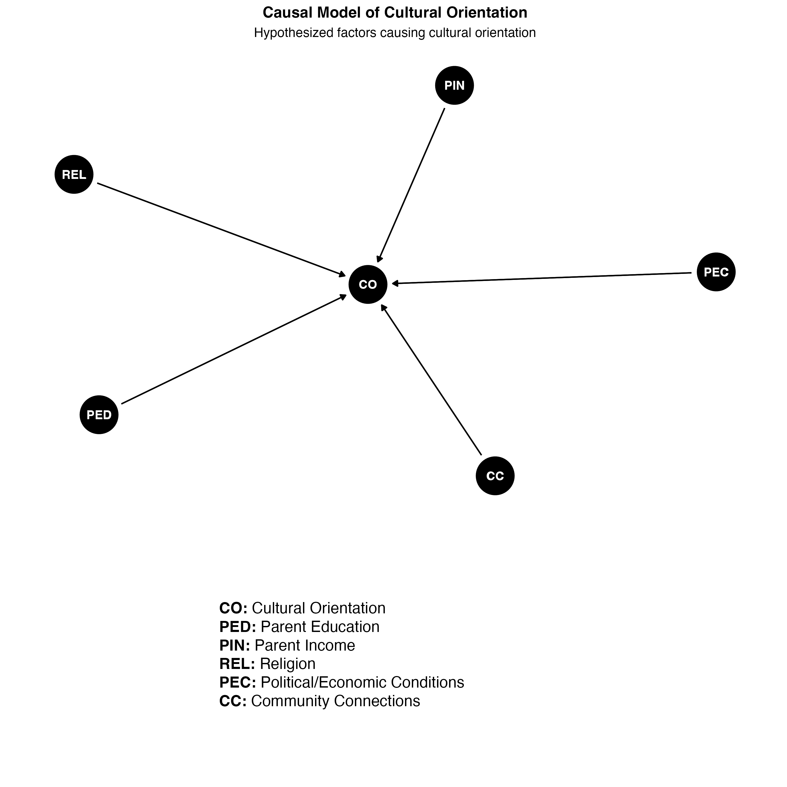

```{r setup, include=FALSE}
knitr::opts_chunk$set(echo = FALSE)

library(dplyr)
library(purrr)
library(janitor)
library(dagitty)
library(ggplot2)
library(ggdag)
library(ggtext)
library(cowplot)
library(stringr)
library(kableExtra)

# Colors from: https://tailwindcss.com/docs/customizing-colors
source("colors.R")
source("utils.R")
set.seed(123)
```

```{r dagSetup, include=FALSE}

rcp_formula <- formula("RCP ~ PQ + PC + WTP + PT + RA + RP")

pq_formula <- formula("PQ ~ PEC")
pc_formula <- formula("PC ~ DEP + JOB + INC + DIS")
wtp_formula <- formula("WTP ~ PQ + INC + INS + RA + CO")
pt_formula <- formula("PT ~ PQ + RE + CO")
ra_formula <- formula("RA ~ PQ + RP + INS")
rp_formula <- formula("RP ~ PQ + AGE + OBE + MG + DM + HD + PP + PR + HT + GHT")

pec_formula <- formula("PEC ~ ST")
dep_formula <- formula("DEP ~ INC + JOB + CO")
job_formula <- formula("JOB ~ EDU + CO + R + M + I + CC")
dis_formula <- formula("DIS ~ PEC")
inc_formula <- formula("INC ~ JOB + EDU + RE + PEC + AGE")
ins_formula <- formula("INS ~ JOB + PEC + AGE")
co_formula <- formula("CO ~ PED + PIN + REL + PEC + CC")
pin_formula <- formula("PIN ~ PEC + PED")
edu_formula <- formula("EDU ~ PED + PIN + R + M + I + CC")
r_formula <- formula("R ~ PR")
m_formula <- formula("M ~ PM")
i_formula <- formula("I ~ PI")
cc_formula <- formula("CC ~ PCC")
rel_formula <- formula("REL ~ RE")

obe_formula <- formula("OBE ~ PEC + AGE")
mg_formula <- formula("MG ~ AGE + OBE")
dm_formula <- formula("DM ~ AGE + OBE + INC")
hd_formula <- formula("HD ~ AGE + OBE + DM")
pp_formula <- formula("PP ~ AGE + MG")
pr_formula <- formula("PR ~ AGE + HT + GHT + MG")
ht_formula <- formula("HT ~ AGE + OBE")
ght_formula <- formula("GHT ~ HT + MG")

dag_labels <- c(
  RCP = "Received Comprehensive Postnatal Care",
  PQ = "Provider Quality",
  PC = "Personal Capacity",
  WTP = "Willingness to Pay",
  PT = "Provider Trust",
  RA = "Risk Aversion",
  RP = "Risk Profile",
  PEC = "Political/Economic Conditions",
  DEP = "Dependents",
  JOB = "Job Type",
  INC = "Income",
  ST = "State",
  DIS = "Distance to Provider (Miles)",
  INS = "Insurance",
  CO = "Cultural Orientation",
  RE = "Race/Ethnicity",
  EDU = "Educational Attainment",
  REL = "Religion",
  AGE = "Age",
  OBE = "Obesity",
  MG = "Multiple Gestation",
  DM = "Diabetes Mellitus",
  HD = "Heart Disease",
  PP = "Placenta Previa",
  PR = "Preeclampsia",
  HT = "Hypertension",
  GHT = "Gestational Hypertension",
  PR = "Parent Resilience",
  PM = "Parent Motivation",
  PI = "Parent Intelligence",
  PCC = "Parent Community Connections",
  PED = "Parent Education",
  PIN = "Parent Income",
  R = "Resilience",
  M = "Motivation",
  I = "Intelligence",
  CC = "Community Connections"
)

```

# Causal Model

We will work backwards from our dependent variable to create a causal model.

Then we will work forwards to sim the data.

## Comprehensive Postnatal Care

Here, we propose a DAG where whether someone receives comprehensive postnatal care is the dependent variable.

This is determined by six latent variables:

* **Provider Quality**: The quality of care provided by the healthcare provider
* **Personal Capacity**: The patient's capacity to attend medical visits
* **Willingness to Pay**: The patient's willingness to pay for medical care
* **Provider Trust**: The patient's trust in the healthcare provider
* **Risk Aversion**: The patient's perception of the risk posed by not receiving care
* **Risk Profile**: The patient's risk factors for postnatal complications

```{r dags, echo=FALSE}
rcp <- summarize_design(rcp_formula)
pq <- summarize_design(pq_formula, plot_height = 6)
wtp <- summarize_design(wtp_formula)
pc <- summarize_design(pc_formula, plot_height = 7)
pt <- summarize_design(pt_formula, plot_height = 6)
ra <- summarize_design(ra_formula, plot_height = 7)
rp <- summarize_design(rp_formula, plot_height = 12)

pec <- summarize_design(pec_formula, plot_height = 6)
dep <- summarize_design(dep_formula)
job <- summarize_design(job_formula, plot_height = 12)
dis <- summarize_design(dis_formula, plot_height = 6)
inc <- summarize_design(inc_formula, plot_height = 10)
ins <- summarize_design(ins_formula)
co <- summarize_design(co_formula, plot_height = 10)
pin <- summarize_design(pin_formula, plot_height = 6)
edu <- summarize_design(edu_formula, plot_height = 12)
r <- summarize_design(r_formula, plot_height = 6)
m <- summarize_design(m_formula, plot_height = 6)
i <- summarize_design(i_formula, plot_height = 6)
cc <- summarize_design(cc_formula, plot_height = 6)
rel <- summarize_design(rel_formula, plot_height = 7)

obe <- summarize_design(obe_formula, plot_height=7)
mg <- summarize_design(mg_formula, plot_height=7)
dm <- summarize_design(dm_formula, plot_height=7)
hd <- summarize_design(hd_formula, plot_height=7)
pp <- summarize_design(pp_formula, plot_height=7)
pr <- summarize_design(pr_formula, plot_height=7)
ht <- summarize_design(ht_formula, plot_height=7)
ght <- summarize_design(ght_formula, plot_height=7)
```


# Expand out the fundamental causes

We are going to expand out the fundamental causes. To do this, we'll use subformulas 

## Provider Quality


### Willingness to Pay


## Personal Capacity


## Provider Trust


## Risk Aversion


## Risk Profile


## Political/Economic Conditions


## Dependents


## Job Type


## Distance to Provider


## Income


## Insurance


## Cultural Orientation


## Parental Income


## Educational Attainment


## Resilience 


## Motivation


## Intelligence


## Community Connections


## Religion


# Full Dag

```{r full_dag}

full_dag <- dagify(
  rcp_formula,
  pq_formula,
  pc_formula,
  wtp_formula,
  pt_formula,
  ra_formula,
  rp_formula,
  pec_formula,
  dep_formula,
  job_formula,
  dis_formula,
  inc_formula,
  ins_formula,
  co_formula,
  pin_formula,
  edu_formula,
  r_formula,
  m_formula,
  i_formula,
  cc_formula,
  rel_formula,
  obe_formula,
  mg_formula,
  dm_formula,
  hd_formula,
  pp_formula,
  pr_formula,
  ht_formula,
  ght_formula,
  outcome="RCP",
  exposure="PT",
  labels=dag_labels
  ) |> tidy_dagitty()

full_dag_plot <- ggdag(full_dag,  layout="circle") +
    geom_dag_edges() +
    geom_dag_text(aes(label = name), size = 4) +
    theme_dag() +
    theme(
      plot.title = element_text(hjust = 0.5, size = 14, face = "bold"),
      plot.subtitle = element_text(hjust = 0.5, size = 12),
      legend.position = "bottom"
    ) +
    ggtitle("Complete Causal Model", subtitle = "All paths shown")

legend_text <- paste(paste0("**", names(dag_labels), ":** "), dag_labels, collapse = "<br>")

annotation_plot <- ggplot() +
  geom_textbox(
    aes(x = 0.5, y = 1),
    label = legend_text,
    halign = 0,
    valign = 1,
    size = 5,
    box.size = NA,
    fill = NA,
    width = unit(12, "cm"),
    family = "sans",
    color = "black",
    lineheight = 1.2
  ) +
  theme_void() +
  theme(plot.margin = margin(10, 10, 10, 10))

   
combined_plot <- plot_grid(
  annotation_plot, full_dag_plot,
  ncol = 2, 
  rel_widths = c(2, 3)
)

save_dag_plot(combined_plot, "full_dag_plot", width=20, height=10)

```

## Some Diagnostics

Exogenous variables:

```{r diagnostics}
exogenous_vars <- exogenousVariables(full_dag$dag)

exogenous_vars |> cat(sep="\n")
```

Is the DAG acyclic?

```{r dag_a_dag}


isAcyclic(full_dag$dag) |> cat("\n")
findCycle(full_dag$dag) |> cat("\n")

```